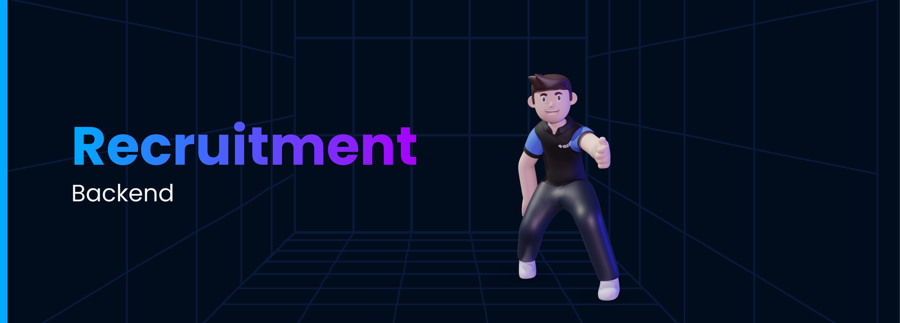

# Recruitments Backend 2020



## About

Recruitment 2020 Backend, This project was to create a backend that ensures a smooth process of recruiting an amazing set of people into IEEE-VIT. It handles both Admin as well as user sides and has an MVC based monolith architecture. Uses 2FA by utilising Firebase Authentication and uses PostgresSQL as its database.

Authentication by Firebase and Authorisation by JWT are covered with robust middleware implementations.
## Tools and technology used

* Node.js
* Express
* Postgres
* Sequelize
* Firebase (Firestore database)
* Docker
* Azure
* Heroku

## Getting Started

To get started:

* Clone the repo.
`git clone https://github.com/IEEE-VIT/recruitment2020-backend`
* Checkout to a new branch.
`git checkout -b my-amazing-feature`
* Make some amazing changes.
* `git add .`
* `git commit -m "A short description about the feature."`
* `git push origin my-amazing-feature`
* Open a pull request :)

### Environment Variables

```env
DB_SCHEMA=postgres
DB_USERNAME=postgres
DB_PASSWORD=toor
JWT_SECRET=examplevariable
DATABASE_URL=
NODE_ENV=development
ADDSLOT_KEY=keytoaddslot
REGISTERADMIN_KEY=keyforadmin
EMAIL_TOKEN=
private_key_id=
private_key=
client_email=
client_id=
auth_uri=
token_uri=
auth_provider_x509_cert_url=
client_x509_cert_url=
apiKey=
authDomain=
projectId=
storageBucket=
messagingSenderId=
appId=
measurementId=
```

### Development Run

```bash
yarn install
yarn run dev
```

### Production Run

```bash
yarn install
yarn run prod
```

Make Sure to have NODE_ENV=production in .env

### Docker Build

```bash
touch secrets
vim secrets
# Fill secrets with example env and configure accordingly
docker build -t "recruitments2020-backend" .
docker run -p 5000:5000 --env-file secrets recruitments2020-backend
```

To start contributing, check out [`CONTRIBUTING.md`](https://github.com/IEEE-VIT/recruitment2020-backend/tree/master/CONTRIBUTING.md) . New contributors are always welcome to support this project.

## Documentation

### Postman Docs

[API Documentation](https://documenter.getpostman.com/view/11431136/TVmMgd2J)

[Admin API Revised Docs](https://documenter.getpostman.com/view/11431136/TVsoFUzo)

### API Design Docs

[API Design Documentation](https://github.com/IEEE-VIT/recruitment2020-backend/blob/master/overview.md)

## Contributors ✨

Thanks goes to these wonderful people ([emoji key](https://allcontributors.org/docs/en/emoji-key)):

<!-- ALL-CONTRIBUTORS-LIST:START - Do not remove or modify this section -->
<!-- prettier-ignore-start -->
<!-- markdownlint-disable -->
<table>
	<tr>
		<td align="center">
			<a href="https://github.com/DarthBenro008"><br /><sub><b>Hemanth Krishna</b></sub></a><br /> <a href="https://github.com/IEEE-VIT/recruitments2020-backend/commits?author=DarthBenro008" title="Documentation">📖 <a href="https://github.com/IEEE-VIT/recruitments2020-backend/commits?author=DarthBenro008" title="Code"> 💻 </a><a href="#infra-DarthBenro008" title="Infrastructure (Hosting, Build-Tools, etc)"> 🚇 </a>
		</td>
		<td align="center">
			<a href="https://github.com/ShubhamPalriwala"><br /><sub><b>Shubham Palriwala</b></sub></a><br /><a href="https://github.com/IEEE-VIT/recruitments2020-backend/commits?author=ShubhamPalriwala" title="Documentation">📖<a href="https://github.com/IEEE-VIT/recruitments2020-backend/commits?author=DarthBenro008" title="Code">💻 </a>
		</td>
		<td align="center">
			<a href="https://github.com/feniljain"><br /><sub><b>Fenil Jain</b></sub></a><br /><a href="https://github.com/IEEE-VIT/recruitments2020-backend/commits?author=feniljain" title="Code"> 💻 </a>
		</td>
	</tr>
</table>

<br />

<p align="center">Made with ❤ by IEEE-VIT</p>
